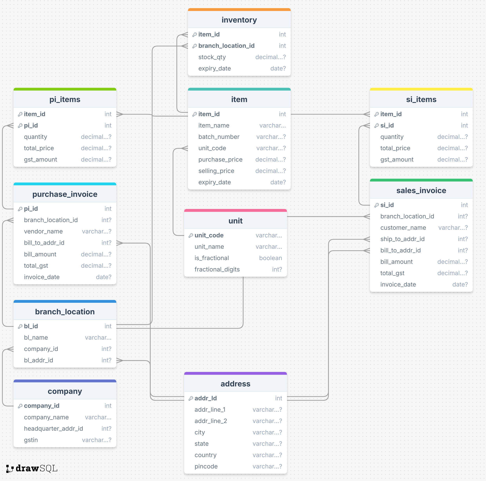

# Inventory Management System using Spring
> Team 1 College DBMS Project

The Inventory Management System is a Spring Boot-based application designed to handle inventory operations for a company. 

<div align = 'center'>


</div>

It features modules for managing:
- Units
- Items
- Addresses
- Companies
- Branch Locations
- Purchase Invoices
- Sales Invoices.

The system uses a `MySQL database` to store data and supports `CRUD Operations`. The backend is built using `Java`, `Spring Boot`, and `JPA` for database interactions. 

The application includes validation mechanisms to ensure data integrity and handles various aspects such of inventory management such as:
- Tracking stock quantities
- Managing purchase and sales invoices
- Monitoring item expiration dates.

---

## Diagrams
<div align = 'center'>


Relational Schema Diagram


ER Diagram
</div>

---

## Run the Project
### Dependencies
- JDK 17 :coffee:
- Maven 3.9.4 :feather:
- Spring Boot 3.1.4 :leaves:
- Python Streamlit :crown:

### Setup
1. Clone this repository
```
git clone https://github.com/KushShriv/Inventory-Management-System-Spring.git
```

2. Build & Run Backend
``` 
mvn clean install
mvn clean compile
mvn spring-boot:run
```

3. Run Frontend
Install streamlit in a virtual env and run this command:
```
streamlit run frontend.py
```
